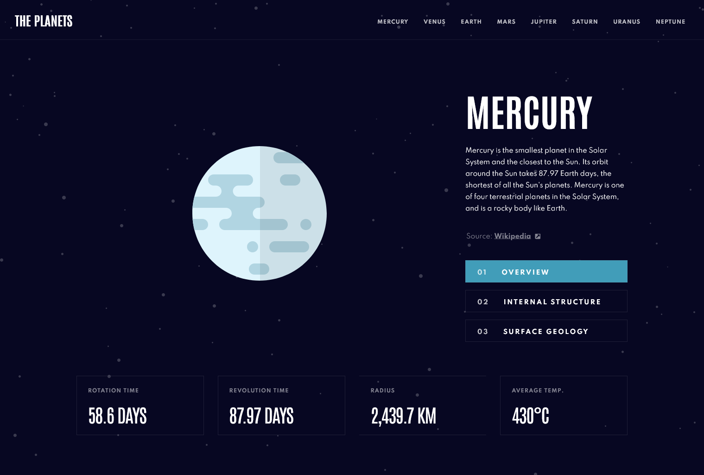

# Frontend Mentor - Planets fact site solution

This is a solution to the [Planets fact site challenge on Frontend Mentor](https://www.frontendmentor.io/challenges/planets-fact-site-gazqN8w_f). Frontend Mentor challenges help you improve your coding skills by building realistic projects. 

## Table of contents

- [Overview](#overview)
  - [The challenge](#the-challenge)
  - [Screenshot](#screenshot)
  - [Links](#links)
- [My process](#my-process)
  - [Built with](#built-with)
  - [What I learned](#what-i-learned)
  - [Useful resources](#useful-resources)
- [Author](#author)
## Overview

### The challenge

Users should be able to:

- View the optimal layout for the app depending on their device's screen size
- See hover states for all interactive elements on the page
- View each planet page and toggle between "Overview", "Internal Structure", and "Surface Geology"

### Screenshot

### Links

- Solution URL: [https://github.com/kpav33/planets-fact-site](https://github.com/kpav33/planets-fact-site)
- Live Site URL: [https://planetes-fact-site.netlify.app/](https://planetes-fact-site.netlify.app/)

## My process

### Built with

- Semantic HTML5 markup
- CSS custom properties
- Flexbox
- CSS Grid
- Mobile-first workflow
- [React](https://reactjs.org/) - JS library
- React Router
- TypeScript
- [Styled Components](https://styled-components.com/) - For styles

### What I learned

In this project I familiarized myself with TypeScript for the first time.

### Useful resources

- [React with TypeScript Crash Course - 2021](https://www.youtube.com/watch?v=jrKcJxF0lAU) - Used it to learn the basic of how to work with TypeScript

## Author

- Frontend Mentor - [@kpav33](https://www.frontendmentor.io/profile/kpav33)
